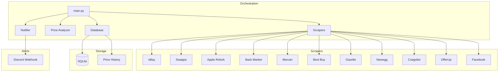
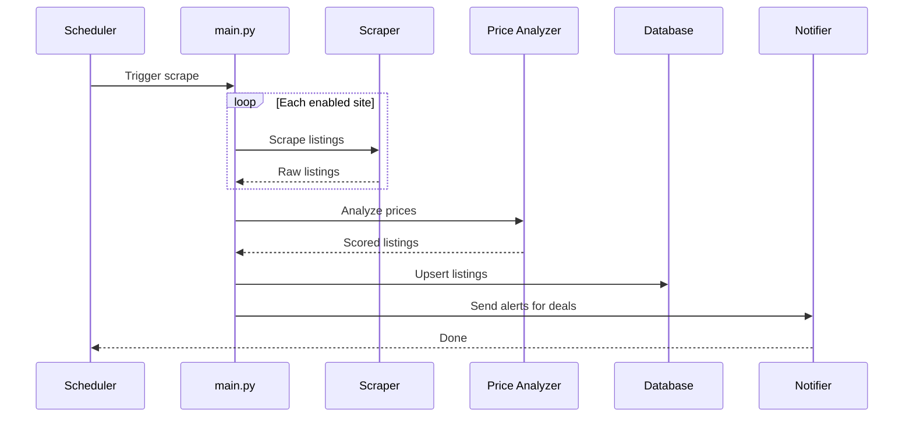
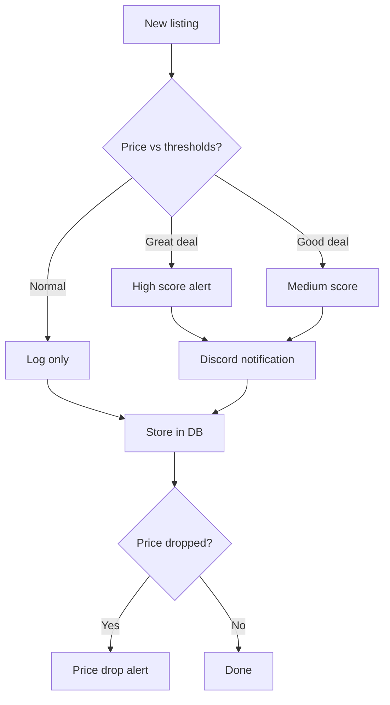

# landonkea-apple-products-scraper - Design & Workflow

## High-Level Overview

## Scraping Pipeline

## Price Analysis Flow

## File Relationships

| File | Purpose | Used By |
|------|---------|---------|
| `src/main.py` | Orchestrator | Scheduler |
| `src/scrapers/` | Site-specific scrapers | `main.py` |
| `src/price_analyzer.py` | Deal scoring | `main.py` |
| `src/notifier.py` | Discord alerts | `main.py` |
| `src/database.py` | SQLite storage | `main.py` |
| `src/product_types/` | Product handlers | Scrapers |
| `config.yaml` | Configuration | All |
| `tests/` | Test suite | pytest |

## draw.io

[Open in draw.io](https://app.diagrams.net/#RApple%20scraper%20architecture)
